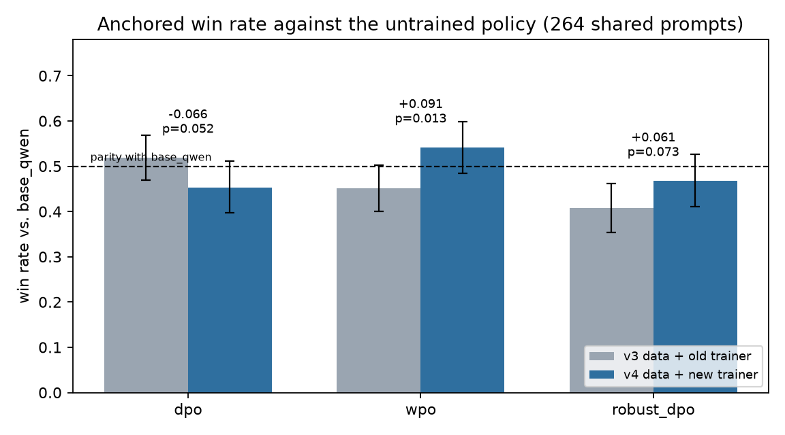
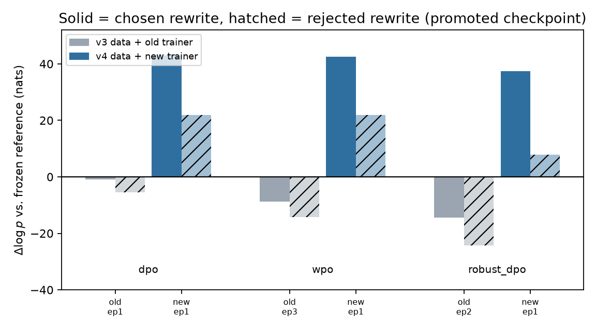
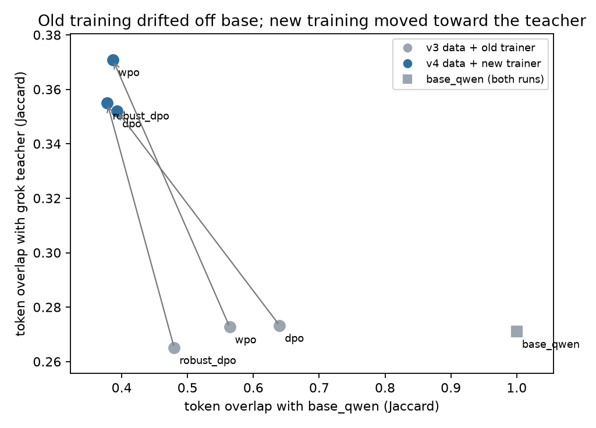
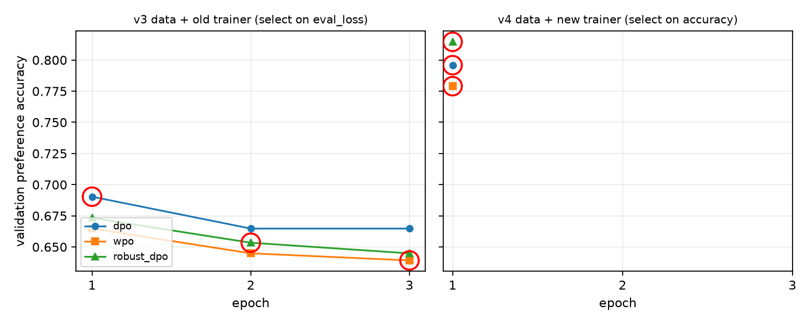
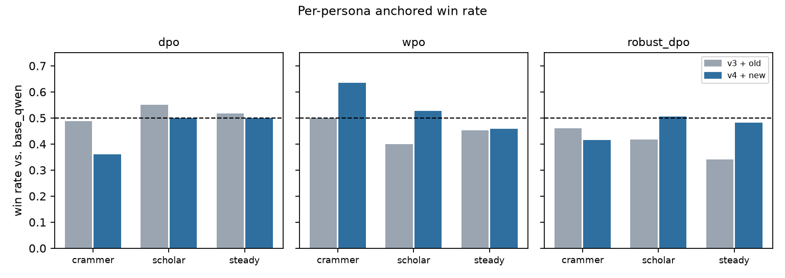
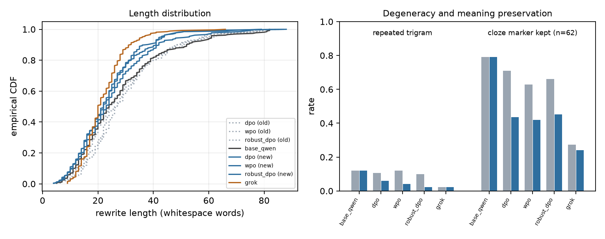

# DPO rewriter arms, seed 42 v2 — v4 data and the repaired trainer

## Decision

`wpo` is the first trained arm in this project to beat the untrained policy. Anchored on
`base_qwen` over the 264 validation prompts both runs share, it moves from 0.451 to
**0.542** (paired $\Delta = +0.091$, 95% CI $[+0.019, +0.159]$, sign-flip $p = 0.013$) and
now leads the round-robin field except for the teacher. `robust_dpo` improves by a similar
amount without clearing parity ($+0.061$, $p = 0.073$). Vanilla `dpo` moved the other way
($-0.066$, $p = 0.052$) and is now the *worst* arm.

The mechanism behind the improvement is unambiguous and is the one
[dpo-arms-seed42-v1](dpo-arms-seed42-v1.md) predicted: **likelihood displacement is gone.**
In v1 every arm made the preferred rewrite *less* likely than the frozen reference did and
manufactured its margin entirely by suppressing the rejected side. In v2 every arm makes
the chosen rewrite **more** likely by roughly +40 nats, and the margin comes from the chosen
side. Measured in output space, v1 training walked away from `base_qwen` without walking
toward the teacher; v2 training walks toward the teacher.

The teacher still wins. `grok-4-1-fast` scores 0.659 round-robin against a best trained arm
of 0.538, and the best any arm manages head-to-head against it is `wpo`'s 0.362. Stage 2 has
gone from "does not work" to "works, and is still not the best available rewriter."

## What changed between the two runs

Both runs are seed 42, `Qwen/Qwen3-4B` 4-bit, LoRA r=16 on all seven projections, the same
three arms, the same `gemini-3.5-flash-lite` tournament judge, and the same greedy
generation contract. Four things changed at once.

| | v1 run (`models/dpo/oldData-dpo-seed-42`) | v2 run (`models/dpo/dpo-seed-42`) |
|---|---|---|
| Pair data | v3, `format_version: 1`, 1,739 / 351 rows | v4, `format_version: 2`, 2,658 / 534 rows |
| Pair composition | within-persona only | 41.2% within-persona, 58.8% labelled cross-persona |
| Labels | 1 judge sample, no scores persisted | 3 judge samples, rubric sub-scores and margins persisted |
| Epochs | 3 (654 steps) | 1 (333 steps) |
| Checkpoint selection | `eval_loss`, minimizing | `eval_rewards/accuracies`, maximizing |
| Supervised anchor | none | `rpo_alpha: 1.0` on all three arms |
| Wall clock per arm | ~77 min on 2×T4 | ~41 min on 2×T4 |

The data change is audited in [dpo-data-v4-audit](dpo-data-v4-audit.md); the three training
changes are the ones adopted at the end of v1. Because all four landed in the same run, this
document assigns causes mechanistically rather than by ablation — see
[Attribution](#attribution-and-what-is-not-isolated).

## Making the two runs comparable

The runs cannot be compared through `round_robin`, which is relative to the field, or
through raw tournament scores, because the pair regeneration changed the validation prompt
set (272 → 268 keys, 264 shared). Two facts make an anchored comparison valid:

- `base_qwen` is greedy and untrained, and its rewrites are **byte-identical on 259 of the
  264 shared prompts** (the 5 exceptions are batch-padding nondeterminism). It is a fixed
  ruler across runs.
- Restricting to the 264 shared keys shifts every pairing by less than 0.005, so the four
  dropped and four added prompts explain nothing.

Every cross-run number below is therefore *win rate against `base_qwen` on the 264 shared
prompts*, paired per prompt. `grok` is **not** a valid anchor: its API was re-queried, and
only 5 of 264 rewrites are identical between the runs, which alone moves `base_qwen` vs
`grok` by +3.6 points.

## Tournament results

| Arm | vs. `base_qwen` (v1) | vs. `base_qwen` (v2) | Paired $\Delta$ | 95% CI | $p$ |
|---|---:|---:|---:|---|---:|
| `wpo` | 0.4508 | **0.5417** | **+0.091** | $[+0.019, +0.159]$ | 0.013 |
| `robust_dpo` | 0.4072 | 0.4678 | +0.061 | $[-0.006, +0.123]$ | 0.073 |
| `dpo` | 0.5189 | 0.4527 | −0.066 | $[-0.129, -0.004]$ | 0.052 |

Within the v2 field, the ordering is a real reordering and not a shuffle inside the noise
band: `wpo` beats `dpo` 0.614 (Holm $p = 2.1\times10^{-5}$) and `robust_dpo` 0.631
(Holm $p = 9.2\times10^{-7}$), the two largest non-teacher effects in either tournament.
`dpo` vs `robust_dpo` is a clean null at 0.487 with 101 ties.

| Candidate | Round-robin (v1) | Round-robin (v2) | vs. `grok`, shared keys (v1 → v2) |
|---|---:|---:|---|
| `grok` | 0.7054 | 0.6590 | — |
| `wpo` | 0.4343 | **0.5378** | 0.299 → 0.364 |
| `base_qwen` | 0.4848 | 0.4678 | 0.311 → 0.347 |
| `robust_dpo` | 0.3833 | 0.4221 | 0.248 → 0.335 |
| `dpo` | 0.4922 | 0.4132 | 0.314 → 0.324 |

The teacher column moves for two reasons at once — the arms improved and `grok`'s regenerated
text is slightly weaker — so subtract the `base_qwen` row's +3.6 points as the teacher-side
drift: net of it, `robust_dpo` gains ~5 points on the teacher, `wpo` ~3, and `dpo` loses ~3.
Directionally this corroborates the anchored table; it is not independent evidence.

`selected_variant: wpo` appears in both `summary.json` files. In v1 that string named the
second-worst candidate and had to be disclaimed. In v2 it names the best trained arm.

## Why the results improved

### 1. The margin now comes from the chosen side

$\Delta\log p$ is the logged reward divided by $\beta = 0.1$: the total shift in sequence
log-probability against the frozen reference, in nats, at the checkpoint each arm actually
promoted.

| Arm | Run | Promoted | $\Delta\log p$(chosen) | $\Delta\log p$(rejected) | Margin | From chosen | Eval acc |
|---|---|---|---:|---:|---:|---:|---:|
| `dpo` | v1 | ep 1 | −0.8 | −5.5 | 0.468 | −18% | 0.690 |
| `wpo` | v1 | ep 3 | −8.8 | −14.2 | 0.545 | −161% | 0.639 |
| `robust_dpo` | v1 | ep 2 | −14.4 | −24.4 | 0.993 | −145% | 0.653 |
| `dpo` | v2 | ep 1 | **+43.1** | +21.9 | 2.121 | **+203%** | 0.796 |
| `wpo` | v2 | ep 1 | **+42.6** | +21.9 | 2.066 | **+206%** | 0.779 |
| `robust_dpo` | v2 | ep 1 | **+37.4** | +7.8 | 2.965 | **+126%** | 0.815 |

This is the direct signature of `rpo_alpha: 1.0`. TRL adds $\alpha \cdot \text{NLL(chosen)}$
to the preference loss, so the objective became "imitate the chosen rewrite *and* separate it
from the rejected one." Both sides of the pair now rise, the chosen side faster. The v1
pathology — a policy learning to avoid one style without learning to produce the other —
is absent from all three arms.

The consequence is that v1's dominant predictor is dead. In v1, chosen-side displacement
correlated with tournament score at Pearson $r = 0.991$ across the four candidates; in v2
that correlation is $r = -0.04$. Displacement was the binding constraint and no longer is,
which is exactly what "the fix worked" should look like — and it means arm ranking in v2 is
decided by something else (see [What still limits the arms](#what-still-limits-the-arms)).

### 2. Training now moves toward the teacher, not merely away from base

Token-overlap (Jaccard) of each candidate's rewrites against `base_qwen`'s and against
`grok`'s, on the same 264 prompts:

| Arm | → `base_qwen` (v1 → v2) | → `grok` (v1 → v2) |
|---|---|---|
| `dpo` | 0.640 → 0.393 | 0.273 → 0.352 |
| `wpo` | 0.564 → 0.387 | 0.273 → 0.371 |
| `robust_dpo` | 0.480 → 0.378 | 0.265 → 0.355 |
| `base_qwen` | 1.000 | 0.275 |

In v1 the arms lost up to 52% of their overlap with `base_qwen` while their overlap with the
teacher stayed pinned at the untrained policy's own 0.27 — motion without direction. In v2
every arm gains 8–10 points of teacher overlap. `wpo` moves furthest toward the teacher
(0.371) and scores best, which is the first monotone relationship between an output-space
measurement and the tournament that this project has had.

### 3. Checkpoint selection stopped promoting degraded checkpoints

In v1, validation preference accuracy peaked at epoch 1 in all three arms and declined
monotonically, while `eval_loss` — rescaled per loss type, and for `wpo` multiplied by a
policy-dependent weight near 0.11 — promoted epochs 1, 3 and 2. `wpo` was hit hardest: it
promoted its *worst* checkpoint (0.639 vs 0.665 at epoch 1). Under one epoch this cannot
recur, and `wpo`'s +0.091 is partly the repair of that specific selection failure.

The vertical jump in the right panel (0.65–0.69 → 0.78–0.81) is **not** a like-for-like
gain: v4 has a different validation set, with 58.8% cross-persona pairs whose median margin
(0.211) is wider than within-persona pairs' (0.125). Cleaner labels and an easier pair mix
both inflate it. Accuracy is a valid *within-arm* selector, which is its job; it is not a
cross-run quality metric, and in v2 it does not even rank the arms — `robust_dpo` has the
highest accuracy (0.815) and the second-worst tournament score.

### 4. Personalization became real, and that is the data's contribution

The count of questions where a candidate emits the *same* rewrite for two different personas,
plus mean cross-persona token overlap within a question (lower = more differentiated):

| Candidate | Identical across personas (v1 → v2) | Cross-persona overlap (v1 → v2) |
|---|---|---|
| `base_qwen` | 6 → 6 | 0.521 → 0.526 |
| `dpo` | 2 → **0** | 0.462 → 0.388 |
| `wpo` | 2 → **0** | 0.415 → 0.419 |
| `robust_dpo` | 1 → **0** | 0.333 → 0.383 |
| `grok` | 0 → 0 | 0.342 → 0.354 |

All three v2 arms sit in the teacher's differentiation band (~0.35–0.42) with zero collapsed
groups, against `base_qwen`'s 0.52 and six collapses. This is the effect the 1,564
cross-persona rows were added to produce: a negative that is the *same question rewritten
for the wrong learner* teaches persona discrimination in a way a within-persona negative
cannot. The v4 audit established that the judge scores such a swap 0.180 lower in 97.1% of
cases; this is that signal reaching the policy.

Per persona, the gains are not uniform:

| Arm | crammer (v1 → v2) | scholar (v1 → v2) | steady (v1 → v2) |
|---|---|---|---|
| `wpo` | 0.500 → **0.635** | 0.400 → 0.528 | 0.453 → 0.459 |
| `robust_dpo` | 0.461 → 0.416 | 0.417 → 0.506 | 0.341 → 0.482 |
| `dpo` | 0.489 → **0.360** | 0.550 → 0.500 | 0.518 → 0.500 |

`wpo`'s whole advantage is crammer and scholar — precisely the two personas where v1 found
the teacher's edge concentrated (0.821 and 0.780 vs 0.510 on steady). `dpo`'s regression is
also almost entirely crammer, the persona that draws the longest rewrites from every
candidate (`base_qwen` averages 33.0 words there against 26.4 and 25.7) and that carries the
most training rows in v4 (1,032, against 555 in v3). Source queries are the same length for
all three personas (34.6 / 34.4 / 33.3 words), so the asymmetry is in the rewriting, not the
input.

### 5. Outputs got shorter, cleaner, and less repetitive

| Candidate | Mean words (v1 → v2) | Repeated trigram (v1 → v2) | Cloze marker kept, $n=62$ |
|---|---|---|---|
| `base_qwen` | 28.5 → 28.5 | 0.121 → 0.121 | 0.790 |
| `dpo` | 28.6 → 25.4 | 0.106 → **0.061** | 0.710 → 0.435 |
| `wpo` | 29.5 → 23.6 | 0.121 → **0.042** | 0.629 → 0.419 |
| `robust_dpo` | 30.3 → 23.3 | 0.098 → **0.023** | 0.661 → 0.452 |
| `grok` | 21.8 → 22.1 | 0.023 → 0.023 | 0.274 → 0.242 |

Length and repetition both converge on the teacher, and `robust_dpo` reaches the teacher's
degeneracy rate exactly. Note the direction: DPO variants usually get *longer* under
optimization pressure; the supervised anchor produced the opposite, which is one more
confirmation that imitation rather than margin-chasing is now driving the update.

The cloze column is the cost side and is an inherited flaw, not a new one. On the 62 prompts
whose source question contains a fill-in-the-blank marker, the teacher preserves it only
24–27% of the time; v2 arms dropped from ~65% to ~43% as they moved toward the teacher. Judge
reasons on `dpo`'s crammer losses name it directly: *"loses the specific context of the
fill-in-the-blank text needed for retrieval."* The rubric's `meaning_preservation` weight of
0.40 is evidently not enough to stop the teacher from discarding cloze structure, so the arms
learned to discard it too.

## What still limits the arms

- **The teacher gap did not close.** `wpo` 0.362 against `grok` is the best result on record
  here and still a decisive loss. Nothing in v2 contradicts v1's structural conclusion that a
  preference-margin objective is the wrong instrument for closing a large off-policy teacher
  gap; `rpo_alpha` helped precisely because it is the *supervised* term.
- **`dpo` over-imitated and broke.** With the anchor at full strength and no WPO
  down-weighting, `dpo` produced the artifacts its judge reasons describe: *"repetitive
  garbled text"*, *"unnatural repetitions"*, and malformed Persian compounds such as
  `نهم‌رسی` (a ZWNJ-joined merge of نهم and درسی). Corroborating counts: Latin-character
  ratio rose from 0.0002 to 0.0064 and Arabic `ي`/`ك` appear in 1–2 rewrites per arm, absent
  in v1. `wpo`'s advantage is plausibly that TRL applies the WPO weight *after* the anchor
  (`losses + rpo_alpha * nll_loss`, then `losses * policy_weights`), making its effective
  anchor ~9× weaker on this data — the same asymmetry v1 recorded as a caveat now looks like
  the reason `wpo` won. **This is a hypothesis with mechanistic support, not a measured
  claim; it needs an `rpo_alpha` sweep to confirm.**
- **One seed, and a judge floor.** All numbers are seed 42 with a single tournament.
  [judge-agreement-luna-gemini-v1](judge-agreement-luna-gemini-v1.md) puts inter-judge
  agreement at 73.0% on decisive verdicts, so ~30% of pairs are rubric-undetermined; at
  $n = 264$ the design resolves roughly ±5 points. `wpo`'s +9.1 clears that; `robust_dpo`'s
  +6.1 and `dpo`'s −6.6 sit near it, which is why both are reported at $p \approx 0.05$–$0.07$
  rather than as settled effects.
- **Training ignores the labels' strength.** v4 persists `margin`, `chosen_score`,
  `rejected_score` and three rubric sub-scores per row. `dpo_train.py` validates these fields
  and then trains on the binary preference alone; a 0.04-margin pair and a 0.76-margin pair
  contribute identically.

## Attribution, and what is not isolated

Four changes shipped together, so this run cannot apportion the +9.1 points by ablation.
What the evidence does support:

| Observation | Assigned to | Strength |
|---|---|---|
| Chosen-side displacement flipped from −0.8…−14.4 to +37…+43 nats | `rpo_alpha: 1.0` | Mechanical property of the added NLL term; no other change can produce it |
| `wpo` no longer promotes a degraded epoch-3 checkpoint | one epoch + accuracy selection | v1 logs show epoch 1 was already its accuracy peak |
| Zero persona-collapsed groups; overlap in the teacher's band | cross-persona pairs in v4 | Only v4 contains a negative that differs *only* by target persona |
| Eval accuracy 0.65–0.69 → 0.78–0.81 | v4 labels **and** an easier v4 pair mix | Not separable: different validation set. `[INFERENCE]` |
| `dpo` regressing while `wpo` and `robust_dpo` improved | anchor strength interacting with the loss | Hypothesis; supported by the WPO-weight ordering in TRL and by the artifact counts |

## Ideas worth considering (none adopted here)

Recorded as options, not decisions. No configuration change follows from this document.

**Cheap, and would sharpen what is already measured**

1. **Report tournament and eval accuracy split by `pair_type`.** The pooled selector is
   58.8% cross-persona and those pairs carry a wider margin, so a run can look strong on the
   easy half. `run_manifest.json` already records the composition; the trainer just does not
   evaluate the halves separately.
2. **Replication seeds.** The config already declares `replication_seeds: [43, 44]` and the
   tournament script supports them. Three seeds would move `wpo` from "one significant run"
   to a defensible claim, and would settle whether `dpo`'s −0.066 is real.
3. **A Persian-normalization check in the comparison script.** The Latin-ratio and Arabic
   ye/ke drift was found by hand here; it is a two-line assertion over the output dumps.

**Would test the leading hypothesis about why `wpo` won**

4. **Sweep `rpo_alpha`** (e.g. 0.5 / 1.0 / 2.0) on the `dpo` arm alone. If the anchor is what
   broke `dpo` and the WPO weight is what saved `wpo`, a lower alpha on plain `dpo` should
   recover most of `wpo`'s score at a fraction of the arms.
5. **Use the persisted margins.** Weighting each pair by its judge margin, or switching to a
   margin-aware objective, is the smallest way to spend the data v4 already carries.

**Larger, and aimed at the teacher gap rather than the objective**

6. **SFT/KD on the chosen rewrites, then DPO on top.** v1 argued for this from the failure;
   v2 argues for it from the success, since the term that helped was the supervised one. A
   two-stage recipe also shrinks the off-policy gap that `rpo_alpha` only patches.
7. **On-policy pairs.** Sample candidates from `Qwen3-4B` itself and have Luna score them, so
   the negative is text the policy actually produces. This is the principled fix for
   likelihood displacement; the cost is a fresh generation and judging pass.
8. **Guard meaning preservation explicitly.** Cloze retention is measurable per rewrite and
   could be a generator-side filter, a rubric weight change, or a hard constraint. The teacher
   is the source of the loss, so filtering teacher candidates that drop the blank would fix it
   at the root.
9. **Address the scholar skew.** The v4 audit found `scholar` appearing as the negative 1.6×
   more often than as the positive, and 33 of 40 empty train groups are scholar. `scholar`
   remains the persona where `wpo` gains least in absolute terms.

## Reproduction

| Artifact | Location |
|---|---|
| v2 run manifests, metrics, promoted adapters | `models/dpo/dpo-seed-42/runs/{arm}/seed-42/` |
| v2 tournament: summary, per-job judgments, output dumps | `models/dpo/dpo-seed-42/comparisons/seed-42/` |
| v1 run, same layout | `models/dpo/oldData-dpo-seed-42/` |
| Figures and every number in this document | `docs/results/figures/dpo-v4-vs-v3/`, regenerate with `python benchmarks/plot_dpo_comparison.py` |
| Pair files | `data/dpo/{train,val}.jsonl` (v4), `data/dpo/old_v3/` (v1 run) |
| Config | `configs/train_dpo.yaml`; notebook `notebooks/train_dpo.ipynb` built by `notebooks/build_train_dpo.py` |

`models/` is gitignored: the two run trees are local artifacts, so the committed record of
this comparison is this document plus `docs/results/figures/dpo-v4-vs-v3/`.
`plot_dpo_comparison.py` recomputes every statistic from the run artifacts and writes
`stats.json` alongside the figures, so no number here is transcribed by hand — rerun it
against the two run directories to reproduce the tables. Bootstrap CIs use 5,000 resamples
and permutation $p$-values 20,000 sign flips, seeded at 42.
