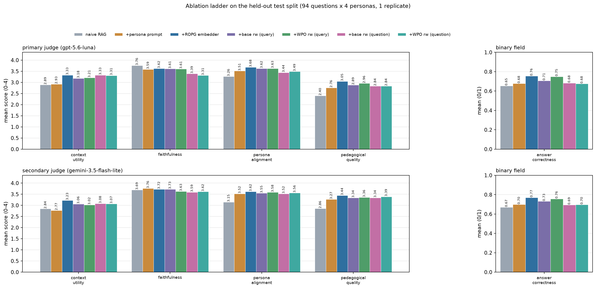
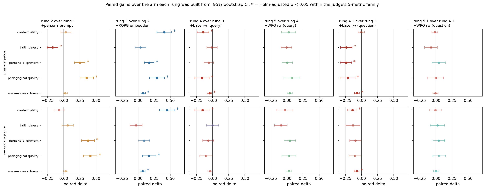
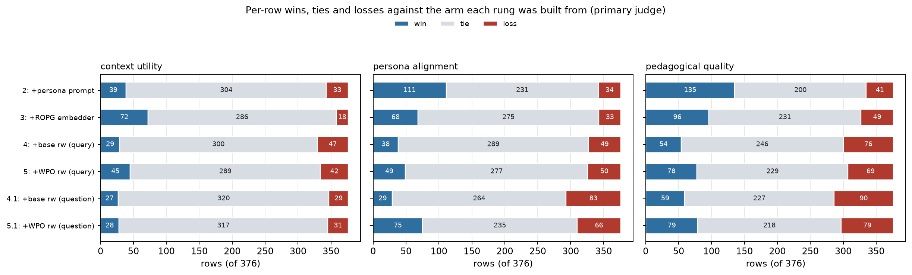
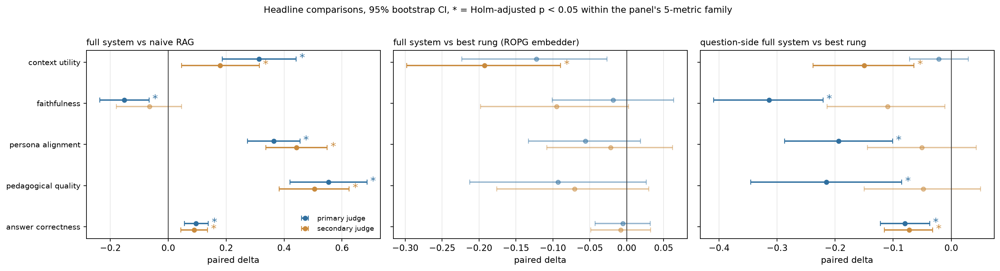
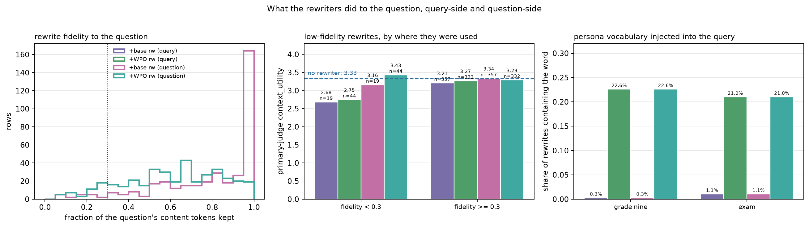
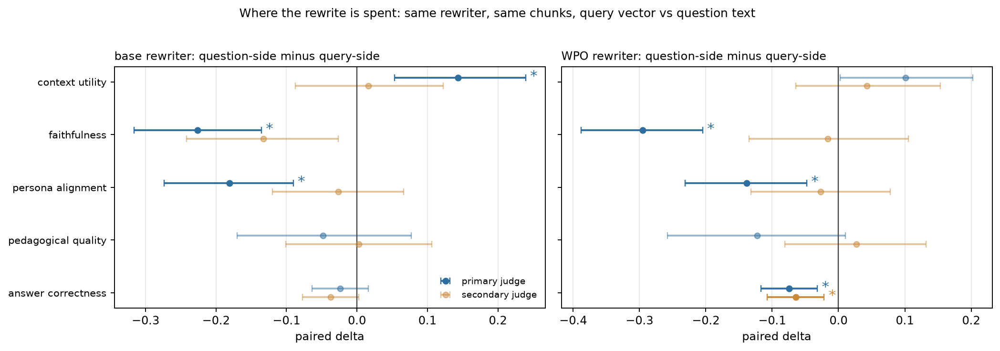
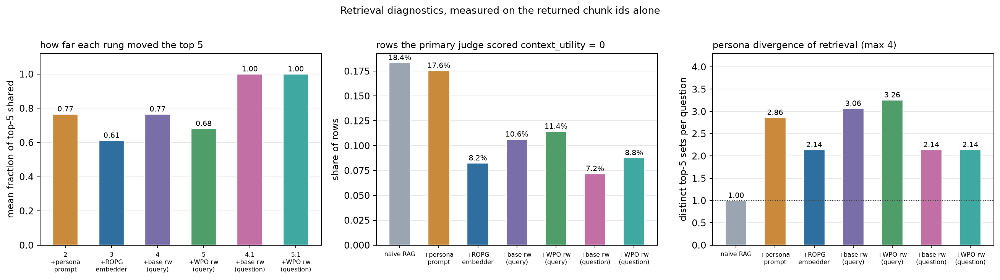
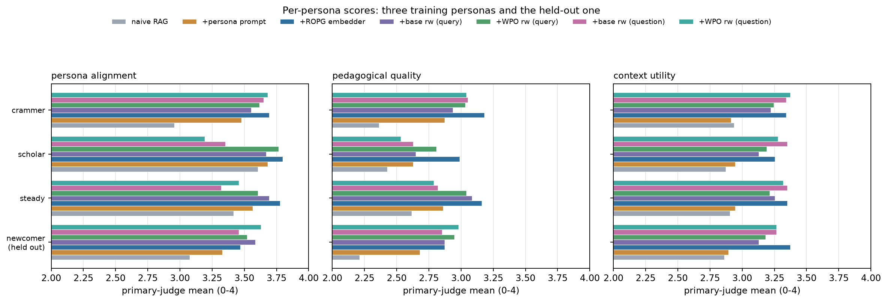
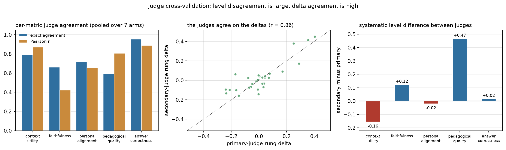

# Held-out ablation v1

## Decision

**The ladder is a gain up to Stage 1 and a loss after it.** Against naive RAG the assembled
system wins on four of five rubric fields, but the best arm is not the full system. It is
**rung 3, the ROPG embedder with persona prompting and no rewriter**. Every rewriting arm sits
below it, and the WPO adapter selected in
[dpo-arms-seed42-v2](dpo-arms-seed42-v2.md) does not recover the loss. It ties the untrained
rewriter wherever it is used.

Four claims survive both judges and Holm correction:

1. **Persona prompting buys persona fit and pedagogy, and pays for it in faithfulness.**
   `persona_alignment` $+0.25$ / $+0.38$ and `pedagogical_quality` $+0.36$ / $+0.41$
   (primary / secondary), with `faithfulness` $-0.17$ on the primary judge.
2. **The ROPG embedder is the load-bearing component.** `context_utility` $+0.40$ / $+0.45$,
   and it is the only rung that improves `answer_correctness` ($+0.077$ / $+0.070$).
3. **Query rewriting is a regression, not an ablation-neutral addition.** The base rewriter
   costs $-0.15$ / $-0.16$ `context_utility`; the WPO rewriter changes nothing on top of it
   (every metric $p_{\text{holm}} = 1.0$).
4. **Rewriting the question the generator answers is worse than rewriting the query vector.**
   Rungs 4.1 and 5.1 keep rung 3's retrieval exactly and spend the same rewrite on the question
   instead. `context_utility` holds, as the design predicts, and everything else falls:
   `faithfulness` $-0.24$, `persona_alignment` $-0.24$, `pedagogical_quality` $-0.21$,
   `answer_correctness` $-0.072$ against rung 3 on the primary judge.

The mechanism behind claims 3 and 4 is measurable in the rewrites themselves. The WPO adapter
keeps only **61%** of each question's content tokens against the base rewriter's **80%**, and
injects persona vocabulary. The word for "grade nine" appears in **22.6%** of its rewrites
versus **0.3%** for the base rewriter. A query that has lost the question retrieves badly. A
*question* that has lost the question cannot be answered at all: on the 44 WPO rows below 0.3
retention, question-side `answer_correctness` falls to **0.36** against rung 3's 0.76.

The honest thesis reading: Stage 1 (ROPG) works, Stage 2 (DPO/WPO rewriting) does not transfer
from its offline preference win to end-to-end quality, and no placement of the rewrite rescues
it. The rewriter's output is not good enough to sit anywhere in the pipeline.

## Experiment inputs

Two runs of the same evaluation harness over the same test split, merged on the
`(question, persona)` key.

| Run | Script | Config | Digest | Arms |
|---|---|---|---|---|
| query-side | `benchmarks/eval_runner.py` | `configs/eval_ablation.yaml` | `e504af60…f397882` | rungs 1-5 |
| question-side | `benchmarks/eval_rewrite_stage.py` | `configs/eval_rewrite_stage.yaml` | `056118a2…68b836a2` | rungs 4.1, 5.1 |

Both ran on 2 x T4 under `torchrun`, from `notebooks/eval_ablation.ipynb` and
`notebooks/eval_rewrite_stage.ipynb`.

| Arm | Rung | Embedder | Profile in prompt | Rewriter | Rewrite goes to |
|---|---|---|---|---|---|
| `base_embedder_no_profile` | 1, naive RAG | base `Qwen3-Embedding-0.6B` | no | none | |
| `base_embedder` | 2, persona prompting | base | yes | none | |
| `trained_embedder` | 3, Stage 1 | ROPG run B | yes | none | |
| `trained_embedder_base_rewriter` | 4, rewriting control | ROPG run B | yes | untrained `Qwen3-4B` | query vector |
| `trained_embedder_rewriter` | 5, full system | ROPG run B | yes | WPO adapter | query vector |
| `trained_embedder_base_rewriter_question` | 4.1 | ROPG run B | yes | untrained `Qwen3-4B` | question text |
| `trained_embedder_rewriter_question` | 5.1 | ROPG run B | yes | WPO adapter | question text |

Rungs 2 to 5 each add exactly one component to the rung below. Rungs 4.1 and 5.1 branch off
rung 3 instead of continuing that chain, so the ladder is a tree: 4.1 is the question-side
counterpart of 4, and 5.1 of 5. Adapters: ROPG `models/ropg-runB/checkpoint-best` (selected in
[ropg-runs-comparison-v1](ropg-runs-comparison-v1.md)); rewriter `models/rewriter-wpo/dpo_best`
(selected in [dpo-arms-seed42-v2](dpo-arms-seed42-v2.md)).

Generator `deepseek-v4-flash` at `temperature: 0.2`. Primary judge `gpt-5.6-luna`
(`reasoning_effort: low`), secondary judge `gemini-3.5-flash-lite`
(`thinking_level: minimal`), rubric in `benchmarks/judge.py`: `context_utility`,
`faithfulness`, `persona_alignment`, `pedagogical_quality` on 0-4 and `answer_correctness` on
0/1. The judge always sees the original question, in every arm, so a question-side rewrite
cannot move the target it is scored against.

**Scale and integrity.** Query-side run: 94 held-out test questions x 4 personas x 5 arms x 1
replicate = **1880 keys, all 1880 successful**, one digest, 0 stale records, 5 chunks on every
row, 11 rows missing a secondary score (0.6%). Question-side run: 94 x 4 x 2 = **752 keys, all
752 successful**, one digest, no missing secondary scores. Wall clock 4h15m and 1h58m. The
query-side run needed two resumes after endpoint credit exhaustion; the question-side run
needed one after rank 0 finished 9 minutes ahead of rank 1 and timed out at the closing
`dist.barrier()`, which is why that barrier now allows 2 hours.

**Why the two runs can be merged.** The manifests agree on the corpus checksum (171 chunks),
the test-qid checksum (94 ids), the rendered persona texts, and every config block except
`arms` and `output_dir`: same generator, same judges, same top-$k$, same embedder, same
rewriter, same adapters, same single replicate. Both runs scored the same 376 keys.
`benchmarks/plot_eval_ablation_v2.py` refuses to plot unless every arm covers the identical key
set, so all seven arms are paired row for row.

**Two controls make the question-side comparison clean.** The rewrites are byte-identical to
the query-side ones on **376 of 376 keys** for both rewriters, because decoding is greedy and
the prompt is unchanged. The retrieved chunk ids are byte-identical to rung 3 on **376 of 376
keys**, because retrieval runs on the untouched persona query. The script asserts both. What
differs between rung 4 and rung 4.1 is one thing: whether that rewrite becomes the query vector
or the question the generator reads.

## Results

Higher is better on every field.



| Judge | Metric | naive | +persona | +ROPG | +base rw (query) | +WPO rw (query) | +base rw (question) | +WPO rw (question) |
|---|---|---:|---:|---:|---:|---:|---:|---:|
| primary | context_utility | 2.894 | 2.926 | **3.330** | 3.184 | 3.207 | 3.327 | 3.309 |
| primary | faithfulness | **3.758** | 3.588 | 3.625 | 3.614 | 3.606 | 3.388 | 3.311 |
| primary | persona_alignment | 3.263 | 3.513 | **3.684** | 3.625 | 3.628 | 3.444 | 3.489 |
| primary | pedagogical_quality | 2.404 | 2.761 | **3.051** | 2.886 | 2.957 | 2.838 | 2.835 |
| primary | answer_correctness | 0.654 | 0.678 | **0.755** | 0.707 | 0.750 | 0.684 | 0.676 |
| secondary | context_utility | 2.845 | 2.771 | **3.227** | 3.064 | 3.022 | 3.080 | 3.072 |
| secondary | faithfulness | 3.694 | **3.757** | 3.725 | 3.726 | 3.628 | 3.593 | 3.617 |
| secondary | persona_alignment | 3.147 | 3.523 | **3.618** | 3.548 | 3.585 | 3.521 | 3.564 |
| secondary | pedagogical_quality | 2.858 | 3.267 | **3.444** | 3.338 | 3.356 | 3.340 | 3.391 |
| secondary | answer_correctness | 0.670 | 0.699 | **0.770** | 0.731 | 0.757 | 0.694 | 0.697 |

Rung 3 takes eight of the ten cells, unchanged by the two new arms. The two it loses are both
`faithfulness`, where the ranking inverts: the arm that personalizes least stays closest to its
context, and the two question-side arms, which personalize the question itself, are the worst
of all seven at 3.388 and 3.311.

### Significance, rung by rung



Stars mark Holm-adjusted $p < 0.05$ **within one judge's five-metric family for one rung**: 5
tests per panel, 10,000 bootstrap resamples at seed 42. This is a deliberately different family
from `paired_deltas.csv`, which each runner corrects across all of its own rows at once. Both
are reported. Where they disagree, the runner's is the conservative bound.

**Rung 2, persona prompting** ($n = 376$ / $372$). The one rung whose effect is a genuine trade.
`pedagogical_quality` $+0.356$ $[+0.253, +0.463]$ and `persona_alignment` $+0.250$
$[+0.168, +0.332]$, both $p_{\text{holm}} = 0.0005$ on both judges. `faithfulness` moves
$-0.170$ $[-0.255, -0.088]$, $p_{\text{holm}} = 0.0005$ on the primary judge; the secondary
judge puts it at $+0.062$ and cannot resolve it. `context_utility` and `answer_correctness` do
not move on either judge, which is expected: this rung changes only the prompt, and the chunks
it changes the prompt against are nearly the same ones.

**Rung 3, the ROPG embedder** ($n = 376$ / $373$). The largest and most consistent effect in the
study. `context_utility` $+0.404$ $[+0.290, +0.521]$ primary and $+0.450$ $[+0.332, +0.568]$
secondary; `pedagogical_quality` $+0.290$ / $+0.172$; `answer_correctness` $+0.077$
$[+0.043, +0.114]$ / $+0.070$ $[+0.030, +0.110]$, all $p_{\text{holm}} \le 0.0054$.
`faithfulness` does not move on either judge: better context did not cost grounding.
`persona_alignment` $+0.170$ is significant on the primary judge only.

**Rung 4, the untrained rewriter on the query** ($n = 376$ / $374$). Every point estimate is
negative on both judges. `context_utility` $-0.146$ $[-0.239, -0.059]$, `pedagogical_quality`
$-0.165$ $[-0.277, -0.053]$ and `answer_correctness` $-0.048$ $[-0.085, -0.013]$ clear the
per-panel family on the primary judge; `context_utility` $-0.158$ $[-0.275, -0.043]$ clears it
on the secondary. This is the rung that breaks the ladder, and it does so *before* any trained
policy is involved. Inserting a query rewriter at all is what costs, not the training.

**Rung 5, the WPO adapter on the query** ($n = 376$ / $371$). Nothing. Every metric on both
judges has $p_{\text{holm}} = 1.0$ except primary `answer_correctness`
($+0.043$ $[+0.003, +0.082]$, $p_{\text{holm}} = 0.29$), and the two judges disagree on the sign
of three of five metrics. The WPO adapter's offline preference win over the untrained policy
does not appear here.

**Rung 4.1, the untrained rewriter on the question** ($n = 376$ / $374$, measured against rung
3). `context_utility` is flat at $-0.003$ $[-0.051, +0.045]$ on the primary judge, which is what
identical retrieval should produce. Everything else drops and every drop clears the family:
`faithfulness` $-0.237$ $[-0.327, -0.146]$, `persona_alignment` $-0.239$ $[-0.330, -0.154]$,
`pedagogical_quality` $-0.213$ $[-0.332, -0.098]$, `answer_correctness` $-0.072$
$[-0.109, -0.035]$, all $p_{\text{holm}} \le 0.0008$. The secondary judge resolves
`context_utility` $-0.142$ and `answer_correctness` $-0.075$ and leaves the other three between
$p_{\text{holm}} = 0.065$ and $0.090$, all negative.

**Rung 5.1, the WPO adapter on the question** ($n = 376$ / $376$, measured against rung 4.1).
Nothing again. Every metric on both judges has $p_{\text{holm}} = 1.0$ except primary
`faithfulness` ($-0.077$, $p_{\text{holm}} = 0.68$). Nothing survives the question-side runner's
own 50-row Holm family either. Whichever side of the pipeline the rewrite lands on, swapping the
untrained rewriter for the trained one changes no measurable outcome.

Under each runner's own Holm family the picture is the same story told more conservatively.
Rungs 2 and 3 keep their headline effects, rung 4's losses drop below the bar, and the
question-side run's only comparison is null:

| Rung | Primary metrics with $p_{\text{holm}} < 0.05$ (runner family) | Secondary |
|---|---|---|
| 2, persona prompt | faithfulness, persona_alignment, pedagogical_quality | persona_alignment, pedagogical_quality |
| 3, ROPG embedder | context_utility, persona_alignment, pedagogical_quality, answer_correctness | context_utility |
| 4, base rewriter (query) | none | none |
| 5, WPO rewriter (query) | none | none |
| 5.1 vs 4.1, question side | none | none |

### The means are not uniform effects



Most rows tie. Rung 3's `context_utility` gain is 72 wins against 18 losses out of 376, with 286
rows unchanged; its `pedagogical_quality` gain is 96 against 49. Rung 4's `pedagogical_quality`
loss is 54 wins against 76 losses. The rubric is coarse, five integer levels, so a rung that
shifts the mean by 0.15 moves roughly a tenth of the rows by one level rather than nudging every
row.

The question-side arms are the exception that proves the reading. Rung 4.1's `context_utility`
against rung 3 is 27 wins, 320 ties, 29 losses, the flattest cell in the study, exactly as
identical retrieval implies. Its `persona_alignment` is 29 wins against **83** losses, the most
lopsided cell in the study. Same retrieval, same judge, different question.

## Headline comparisons



**Full system vs naive RAG.** The thesis-level claim, and it holds on both judges:
`pedagogical_quality` $+0.553$ / $+0.505$, `persona_alignment` $+0.364$ / $+0.443$,
`context_utility` $+0.314$ / $+0.179$, `answer_correctness` $+0.096$ / $+0.090$, all
$p_{\text{holm}} \le 0.019$. `faithfulness` is $-0.152$ $[-0.237, -0.067]$ on the primary judge
($p_{\text{holm}} = 0.0009$) and an unresolved $-0.065$ on the secondary.

**Full system vs rung 3.** The claim that does not hold. `context_utility` is $-0.122$
$[-0.223, -0.027]$ primary and $-0.192$ $[-0.298, -0.089]$ secondary
($p_{\text{holm}} = 0.002$); the other four metrics are indistinguishable from zero on both
judges. The full system is, at best, rung 3 with a retrieval-quality tax.

**Question-side full system vs rung 3.** Worse, and worse in a different place.
`context_utility` is $-0.021$ and unresolved on the primary judge, but `faithfulness` $-0.314$
$[-0.410, -0.221]$, `pedagogical_quality` $-0.215$, `persona_alignment` $-0.194$ and
`answer_correctness` $-0.080$ all clear the family at $p_{\text{holm}} \le 0.0032$. Rung 5 pays
for the rewriter in retrieval quality; rung 5.1 pays for it in the answer.

## Why rewriting loses



The scores say rewriting costs. The rewrites say why.

Measuring each rewrite against its source question by Persian content-token retention (tokens of
$\ge 3$ Persian characters, matched as sets):

| Rewriter | Mean token retention | Rows below 0.3 retention | "grade nine" in rewrite | "exam" in rewrite |
|---|---:|---:|---:|---:|
| untrained `Qwen3-4B` | 0.803 | 5.1% | 0.3% | 1.1% |
| WPO adapter | 0.611 | 11.7% | 22.6% | 21.0% |

These four numbers describe both runs, since the rewrite strings are identical across them.

The WPO adapter systematically discards question content and replaces it with persona
vocabulary. Neither word belongs to any test question; both belong to the persona profiles. It
also hallucinated a *fourth-grade elementary* learner in a handful of rows, a grade level no
persona uses.

On the query side the cost tracks the drift. Rewrites below 0.3 retention score `context_utility`
2.75 (WPO, $n = 44$) and 2.68 (base, $n = 19$); rewrites at or above it score 3.27 and 3.21,
against 3.33 for no rewriter at all. Retention correlates with `context_utility` at $r = +0.16$
(WPO), weak per row and consistent in the aggregate.

This is the failure mode `CLAUDE.md` warns about: a rewriter that games its objective. The
preference pairs rewarded persona-conditioned rewrites, so the adapter learned to inject persona
tokens. Nothing in the DPO objective required it to preserve the question, and the offline judge
that built the pairs never had to retrieve against the result, let alone answer it.

## Rewriting the question instead of the query



### What rungs 4.1 and 5.1 change

In rungs 4 and 5 the rewriter never reaches the generator. The rewritten text is embedded, the
top 5 chunks come back, and the generator then answers the **original** question with the
profile in its system prompt. The rewrite is a retrieval instrument and nothing else, so the
only way it can help is by finding better chunks, and section "Why rewriting loses" shows it
finds worse ones.

That leaves an obvious question the first run could not answer: is the rewriter useless, or was
it merely pointed at the wrong target? A rewrite that turns a terse exam stem into "explain
step by step with an example" is plausibly a better *prompt* even when it is a worse *query*.
Rungs 4.1 and 5.1 test exactly that. Retrieval runs first, on the untouched persona-instructed
query, so the chunks are rung 3's chunks. The same rewriter then produces the same text as
before, and that text replaces the question the generator answers. The profile stays in the
system prompt, so the generator is not deprived of personalization, and the judge still scores
against the original question.

The design isolates one variable. Against rungs 4 and 5, retrieval and the rewrite text are
held constant and only the destination moves. Against rung 3, retrieval is held constant and
only the question moves.

### What happened

Question-side minus query-side, same rewriter, paired over 376 keys:

| Rewriter | Metric | Primary delta | 95% CI | $p_{\text{holm}}$ | Secondary delta |
|---|---|---:|---:|---:|---:|
| base | context_utility | +0.144 | $[+0.053, +0.239]$ | 0.013 | +0.016 |
| base | faithfulness | −0.226 | $[-0.316, -0.136]$ | 0.0005 | −0.133 |
| base | persona_alignment | −0.181 | $[-0.274, -0.090]$ | 0.0008 | −0.027 |
| base | pedagogical_quality | −0.048 | $[-0.170, +0.077]$ | 0.58 | +0.003 |
| base | answer_correctness | −0.024 | $[-0.064, +0.016]$ | 0.58 | −0.037 |
| WPO | context_utility | +0.101 | $[+0.003, +0.202]$ | 0.11 | +0.043 |
| WPO | faithfulness | −0.295 | $[-0.388, -0.205]$ | 0.0005 | −0.016 |
| WPO | persona_alignment | −0.138 | $[-0.231, -0.048]$ | 0.012 | −0.027 |
| WPO | pedagogical_quality | −0.122 | $[-0.258, +0.011]$ | 0.11 | +0.027 |
| WPO | answer_correctness | −0.074 | $[-0.117, -0.032]$ | 0.006 | −0.065 |

Moving the rewrite off the query buys back the retrieval tax, $+0.144$ `context_utility` for the
base rewriter, and the primary judge charges $-0.23$ to $-0.30$ `faithfulness` for it. The trade
is bad: the recovered retrieval is worth about a seventh of a rubric level, the faithfulness loss
about a quarter. On the secondary judge the recovery does not resolve at all and only WPO
`answer_correctness` $-0.065$ survives, so the honest summary is that question-side rewriting
gains little and loses a lot.

Against rung 3, which is the comparison that matters for the ladder, both question-side arms are
strictly worse on four of five fields and level on the fifth. Rung 4.1 is the better of the two,
and it still gives up 0.24 `faithfulness`, 0.24 `persona_alignment` and 7 points of
`answer_correctness`.

### Why it fails

The generator can only answer the question it is given. When the rewrite drops the question,
there is nothing left to answer, and the retrieved chunks cannot rescue it. Splitting the
question-side rows at 0.3 token retention, primary judge:

| Arm | Retention | $n$ | faithfulness | persona_alignment | pedagogical_quality | answer_correctness |
|---|---|---:|---:|---:|---:|---:|
| 4.1 base | $< 0.3$ | 19 | 2.95 | 2.00 | 1.21 | 0.26 |
| 4.1 base | $\ge 0.3$ | 357 | 3.41 | 3.52 | 2.92 | 0.71 |
| 5.1 WPO | $< 0.3$ | 44 | 2.95 | 2.82 | 1.89 | 0.36 |
| 5.1 WPO | $\ge 0.3$ | 332 | 3.36 | 3.58 | 2.96 | 0.72 |
| rung 3 | n/a | 376 | 3.62 | 3.68 | 3.05 | 0.76 |

A row whose question survived the rewrite lands near rung 3. A row whose question did not scores
`pedagogical_quality` 1.21 and gets the answer right one time in four. `context_utility` is the
one field that stays flat across the split (3.16 vs 3.34 for the base rewriter, 3.43 vs 3.29 for
WPO), because those rows retrieved the same chunks as every other row.

One row shows the whole effect. `ai_generated_questions:q96`, persona `crammer`, is a
three-pair matching exercise with all six items listed inline. The WPO rewrite keeps 6% of its
content tokens and reduces it to a request for "a simple step-by-step explanation of the meaning
of the given sentences, matched to their descriptions, for the ninth-grade exam, with examples
and exam tips". Not one of the six items survives. Rung 3 scores that row 4 / 4 / 4 on
faithfulness, persona alignment and pedagogical quality; rung 5.1 scores it 2 / 2 / 1. On
`khordad1404-khorasan:q18` the rewrite drops both verses and asks for the definition of *radif*
in the abstract, so the generator explains a concept instead of labelling the two lines the exam
asked about. Its pedagogical quality falls from 4 to 1 on all three affected personas.

### What this settles

The rewriter is not misplaced, it is not good enough. Both placements were tested against the
same rung-3 baseline with the same rewrite text, and both lose. Query-side rewriting costs
retrieval quality; question-side rewriting costs the answer. The WPO adapter adds nothing over
the untrained rewriter in either position, which is now two independent nulls rather than one.

There is one narrow positive. Question-side rewriting does restore retrieval to rung 3's level
exactly, which confirms the diagnosis in the query-side analysis: the `context_utility` loss at
rungs 4 and 5 is caused by the rewritten query and by nothing else. A rewriter that preserved
question content, trained with retrieval in the loop rather than against an offline preference
judge, remains untested and is the obvious next experiment. Nothing in this run supports
shipping the current one.

## Retrieval diagnostics



Measured on returned chunk ids alone, independent of any judge.

**How far each rung moved the top 5.** Persona prompting shares 0.77 of its top 5 with naive RAG
(the profile enters as the `Instruct:` prefix), the ROPG embedder shares 0.61 with the base
encoder, the query-side base rewriter 0.77 with no rewriter, and the query-side WPO rewriter 0.68
with the base rewriter. Query-side rewriting moves retrieval about as much as swapping the
encoder did, downward. Both question-side arms share **1.00**, which is the design assertion, not
a finding.

**Rows with no usable context.** The primary judge scored `context_utility` = 0, meaning
retrieval returned nothing the answer could use, on 18.4% of naive-RAG rows, 17.6% with persona
prompting, and **8.2%** with the ROPG embedder. Query-side rewriting pushes it back up to 10.6%
and 11.4%. Halving the no-context rate is the clearest single statement of what Stage 1 bought,
and query-side rewriting gives a third of it back.

The question-side arms sit at 7.2% and 8.8% on chunks identical to rung 3's 8.2%, which is worth
stating plainly: `context_utility` is not a retrieval metric. The judge scores how well the
*answer* used its context, so the same five chunks earn a different score depending on what was
asked of them. Treat it as a retrieval proxy only when the question is fixed, which is why the
overlap and divergence panels above are the judge-free measurements.

**Persona divergence.** Without the profile, retrieval is identical across all four personas by
construction (1.00 distinct top-5 sets per question). Persona prompting produces 2.86 distinct
sets, the ROPG embedder **2.14**, the query-side rewriting arms 3.06 and 3.26, and the
question-side arms 2.14 by inheritance. The trained encoder is *less* persona-divergent than the
base encoder with the same prefix, which agrees with the Stage 1 finding that ROPG training
flattened a pre-existing prefix artifact rather than adding persona sensitivity
([ropg-runs-comparison-v1](ropg-runs-comparison-v1.md), persona-swap control). Across the seven
arms, divergence and quality are anti-correlated: the most persona-divergent retrieval is the
least useful.

**No retrieval ground truth on this split.** The test questions carry no relevance labels, so
Recall@K and MRR are not computable here. The labelled retrieval evaluation lives in the Stage 1
report on the validation split.

## Per persona



`crammer`, `scholar` and `steady` appear in the DPO/ROPG training data; `newcomer` is held out.

Persona prompting's `persona_alignment` gain is concentrated where the baseline was weakest:
`crammer` $2.957 \to 3.479$ ($+0.52$) against `scholar` $3.606 \to 3.681$ ($+0.075$). The
naive-RAG answer was already close to what a `scholar` wants, terse and without hand-holding, so
most of rung 2's headline gain is the system learning to stop writing scholar answers for
everyone.

The question-side arms invert that logic and pay for it. Their `persona_alignment` damage lands
almost entirely on the two personas that want brevity and rigour: `scholar` falls
$3.798 \to 3.351$ (rung 4.1) and $3.191$ (rung 5.1), `steady` $3.777 \to 3.319$ and $3.457$,
while `crammer` barely moves ($3.691 \to 3.649$ and $3.681$). The rewrites ask for simple
step-by-step exam-oriented explanations, which is `crammer`'s profile written into the question.
Feeding it to a scholar produces an answer aimed at the wrong learner, and the judge sees the
mismatch against the real profile in the prompt. Personalizing the question overrides the
profile instead of serving it.

The held-out persona is the one place the rewriter looks good: on `newcomer`,
`answer_correctness` goes $0.702 \to 0.777$ and `persona_alignment` $3.468 \to 3.521$ from rung 3
to rung 5, where all three training personas lose, and rung 5.1 posts the highest `newcomer`
`persona_alignment` of any arm at 3.628. **This does not survive testing.** Full system minus
rung 3, split by persona provenance, 10,000 resamples:

| Group | Metric | Delta | 95% CI | $p$ | $p_{\text{holm}}$ | $n$ |
|---|---|---:|---:|---:|---:|---:|
| newcomer | answer_correctness | +0.075 | $[-0.011, +0.160]$ | 0.125 | 1.00 | 94 |
| newcomer | persona_alignment | +0.053 | $[-0.106, +0.223]$ | 0.616 | 1.00 | 94 |
| newcomer | context_utility | −0.192 | $[-0.426, +0.021]$ | 0.108 | 1.00 | 94 |
| 3 training personas | persona_alignment | −0.092 | $[-0.177, -0.007]$ | 0.040 | 0.64 | 282 |
| 3 training personas | pedagogical_quality | −0.149 | $[-0.277, -0.021]$ | 0.029 | 0.55 | 282 |
| 3 training personas | context_utility (secondary) | −0.212 | $[-0.335, -0.097]$ | 0.0004 | 0.008 | 278 |

At $n = 94$ the newcomer intervals are roughly twice as wide as the pooled ones and every one of
them contains zero. The suggestive reading, that the rewriter generalizes to unseen personas
while overfitting the trained ones, is not supported. It is a direction, at one quarter of the
sample size, in a slice chosen after seeing the means.

## Judge cross-validation



Pooled over all seven arms ($n = 2621$ rows scored by both judges):

| Metric | Exact agreement | Pearson $r$ | Secondary − primary |
|---|---:|---:|---:|
| answer_correctness | 0.954 | 0.889 | +0.02 |
| context_utility | 0.792 | 0.870 | −0.16 |
| faithfulness | 0.662 | 0.423 | +0.12 |
| persona_alignment | 0.717 | 0.657 | −0.02 |
| pedagogical_quality | 0.596 | 0.807 | +0.47 |

Two different things are visible, and conflating them would misread the study. **Absolute levels
disagree**: the secondary judge is 0.47 more generous on `pedagogical_quality` and 0.16 stricter
on `context_utility`, so no single-arm score here is a calibrated absolute quantity. **Deltas
agree**: across the 30 rung x metric pairs the two judges' estimates correlate at $r = 0.86$ and
agree in sign on 73% of them, and both rank rung 3 first on every field except `faithfulness`.
Every claim in this report is a delta for that reason.

`faithfulness` is the weak field: $r = 0.42$, the lowest of the five, the field where the judges
split on rung 2's direction, and the field carrying the largest question-side effect. The
question-side faithfulness loss is therefore a primary-judge finding. The secondary judge agrees
on sign for rung 4.1 ($-0.134$, $p_{\text{holm}} = 0.065$) but cannot resolve it, and it puts
rung 5.1 against rung 5 at $-0.016$ where the primary judge reads $-0.295$. That is the single
largest judge disagreement in the study and it should be reported as such. The conclusion about
the question-side arms does not rest on it: `answer_correctness`, which the judges agree on at
$r = 0.89$ and 95% exact agreement, is negative on both judges for both question-side arms
against rung 3 ($-0.072$ / $-0.075$ and $-0.080$ / $-0.072$, all $p_{\text{holm}} \le 0.01$).

The pattern is consistent with
[judge-agreement-luna-gemini-v1](judge-agreement-luna-gemini-v1.md), which found no detectable
difference between the flash and flash-lite secondary judges but did not establish that either
tracks faithfulness reliably.

## Threats to validity

- **One replicate, no seeds.** `replicates: [1]` means every number here has endpoint sampling
  variance folded into it and *no* variance component from training seeds, index rebuilds, or
  data-generation seeds. [experiment-design](../experiment-design.md) asks for $\ge 3$ seeds;
  this study does not meet that. The paired intervals measure uncertainty across the 376 test
  rows only.
- **The question-side arms come from a second run.** Rungs 4.1 and 5.1 were executed days later
  under a second config digest against the same endpoints. The inputs, adapters, judges, and
  generator settings are checksum-identical and the rewrites reproduce byte for byte, so drift
  would have to come from the served models themselves. That is unmeasured. Rungs 4.1 and 5.1 vs
  each other is a within-run comparison and is immune; the comparisons to rungs 3, 4 and 5 are
  cross-run.
- **Held-out questions, overlapping sources.** The split is question-level (seed 42, 70/15/15):
  `question_ref` is disjoint across splits, but source files, and therefore corpus passages, are
  shared. A rung that benefits from passage familiarity is not fully isolated here.
- **The test set is mostly synthetic.** 76 of 94 test questions come from
  `ai_generated_questions`; 18 are real exam items. Persona profiles are synthetic throughout.
- **Judge-generator independence, partially.** The generator (`deepseek-v4-flash`) is independent
  of both judges, and the judge that scored these answers is not the prompt that built the DPO
  pairs, as the repo rules require. But the primary judge (`gpt-5.6-luna`) is the same model
  family that labelled the ROPG and DPO training data, so rung 3's gain is measured partly by the
  teacher that produced its supervision.
- **Multiplicity is a judgement call.** Each runner's own Holm family is conservative to the point
  of hiding rung 4's regression; the per-panel 5-metric family is the one used for the starred
  figures. Both are published; the decision above holds under either.
- **`answer_correctness` is binary and single-rater per judge.** At 0.65 to 0.77 across arms it is
  the coarsest field, and small deltas on it should not be over-read.

## Figures

All nine figures live under `figures/eval-ablation-v1/` and regenerate from the two runs'
`results.jsonl` files with:

```bash
python benchmarks/plot_eval_ablation_v2.py \
    --run results/ablation/complete_eval_results/ablation \
    --question-run results/ablation/remaining_eval_results/rewrite_stage \
    --out docs/results/figures/eval-ablation-v1
```

The script reuses `compare_runs.py`'s `paired_stats` and `holm` and the rubric fields from
`benchmarks/judge.py`. It refuses to plot unless each run carries one config digest and all rows
succeeded, every arm covers the same key set, and the question-side arms reproduce rung 3's
retrieval exactly. Every plotted number goes to `figures/eval-ablation-v1/stats.json`. Bootstrap
CIs and permutation $p$-values use 10,000 resamples at seed 42; the runners' own CSVs use 5,000,
so third-decimal differences between the two are expected.
`benchmarks/plot_eval_ablation.py` is the five-arm predecessor and is kept only because it
reproduces the query-side figures from a single run.

| Figure | What it answers |
|---|---|
| `ladder.png` | Where every arm lands on every rubric field, per judge |
| `headline.png` | Full system against naive RAG, against the best rung, and the question-side variant |
| `rung_deltas.png` | Which single-component effects survive paired CIs and Holm |
| `question_side.png` | What moving the rewrite from the query to the question costs |
| `per_question.png` | Whether the mean shifts are broad or minority effects |
| `rewriter_mechanism.png` | Why rewriting costs, and how the cost changes with placement |
| `retrieval_shift.png` | What each component did to retrieval, judge-free |
| `per_persona.png` | Who the gains belong to, and how the held-out persona behaves |
| `judge_agreement.png` | Whether the second judge reproduces the deltas |

## Artifacts

`results/ablation/complete_eval_results/ablation/` holds the query-side run: `results.jsonl`
(1880 rows, 24 MB), two rank shards, `summary.csv` (550 rows), `paired_deltas.csv` (200 rows),
`judge_agreement.csv` (30 rows), and `run_manifest.json` with input checksums, adapter paths,
model settings, and library versions.
`results/ablation/remaining_eval_results/rewrite_stage/` holds the question-side run in the same
layout: `results.jsonl` (752 rows, 11 MB), `summary.csv` (220 rows), `paired_deltas.csv` (50
rows), `judge_agreement.csv` (15 rows), and its own manifest. Those dumps are large prediction
data and stay out of `docs/`; this document plus `figures/eval-ablation-v1/` is the committed
record.
