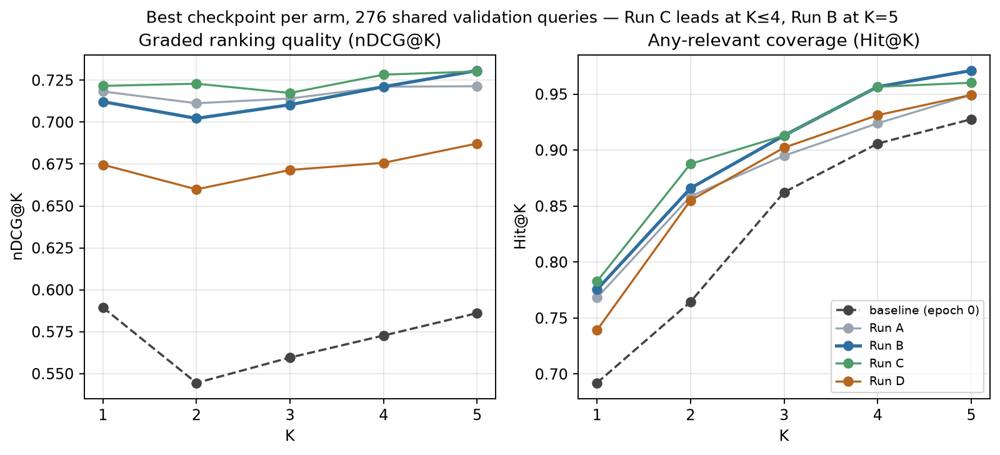
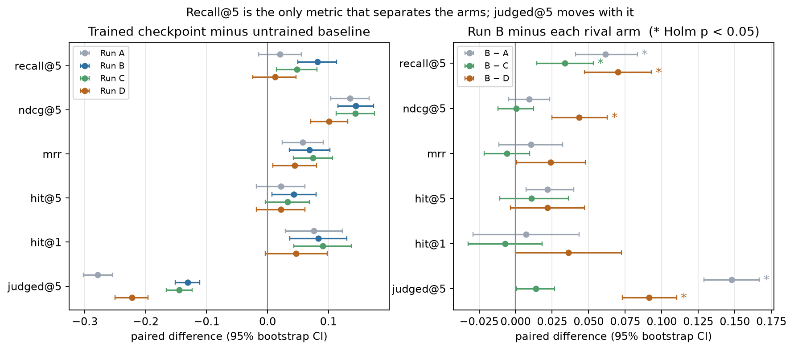
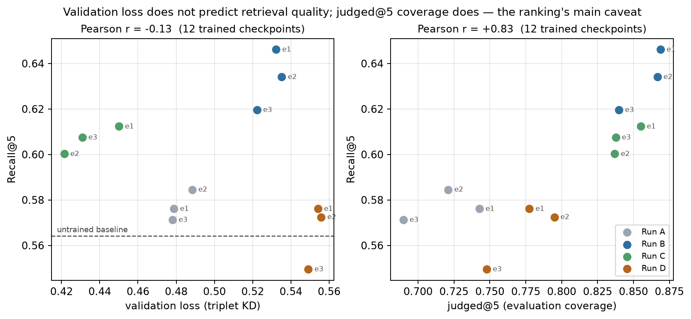
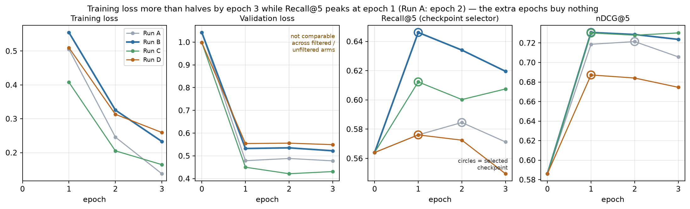
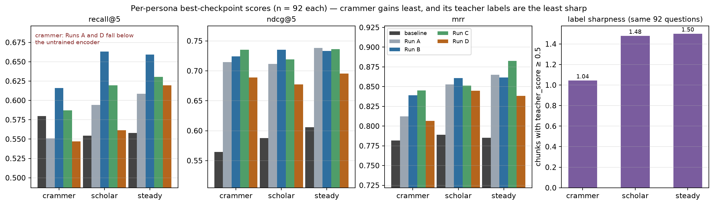
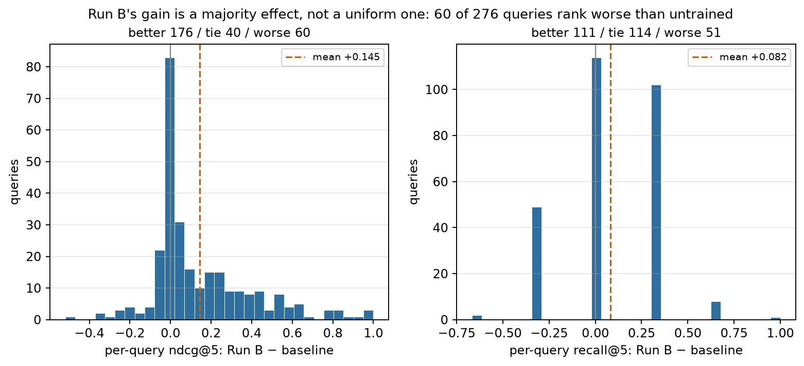
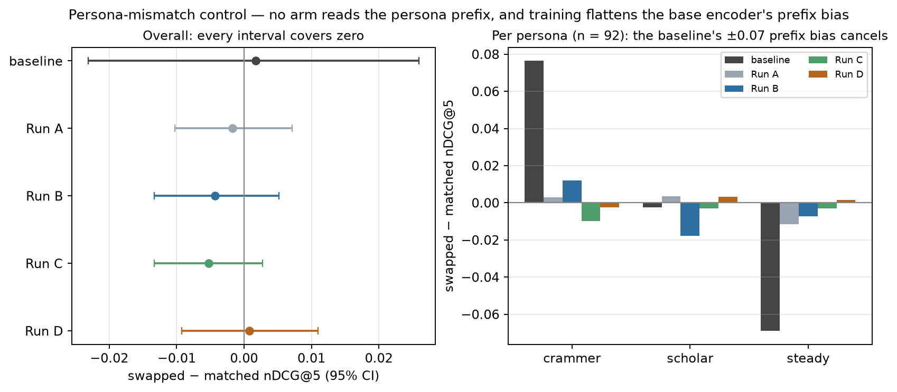

# ROPG runs comparison v1

## Decision

Select **Run B** as the Stage 1 ROPG checkpoint.

Run B has the highest Recall@5, the metric used by `src/rl/ropg_kd.py::is_better` to select checkpoints. It also has the highest nDCG@5 and Hit@5. Run C is slightly better at the first few ranking positions, but none of its advantages over Run B remains statistically significant after Holm correction. Run B's Recall@5 advantage over Run C does remain significant.

Run D is the weakest arm. Freezing the document tower reduced graded ranking quality and recall. None of the four runs produced a statistically significant persona-swap effect, so these results support generic retrieval improvement, not Stage 1 personalization.

## Experiment inputs

The analysis uses each run's `training_log.json` under `models/ropg/`:
The labels are the current Luna era: `gpt-5.6-luna` judged `data/ropg_kd/*.jsonl`, with
`format_version: 4`, generated in commit `ff90cf6`. See [methodology](../methodology.md),
"Label eras — nano (retired) vs Luna (current)".

| Run | Training data | Anchor mode | Best epoch |
|---|---|---|---:|
| A | `ropg_kd`, filters off | `none` | 2 |
| B | `ropg_kd`, filters off | `both` | 1 |
| C | `ropg_kd_filtered`, filters on | `both` | 1 |
| D | `ropg_kd_filtered`, filters on | `doc_frozen` | 1 |

All runs use seed 42, `hard_neg` triplets, three epochs, learning rate $5\times10^{-5}$, and eight negatives. Each evaluation contains the same 276 query and persona rows. Their epoch-0 per-query vectors are identical, which establishes baseline parity for paired tests.

`benchmarks/compare_runs.py` compares best checkpoints with a paired bootstrap confidence interval and a paired sign-flip permutation test. It applies Holm correction across the 13 retrieval metrics. The intervals measure uncertainty across validation queries. Because all runs use one training seed, they do not measure variation across training seeds.

## Best-checkpoint results

Higher is better for every retrieval metric. `judged@5` is a coverage diagnostic rather than a direct quality score.

| Metric | Baseline (epoch 0) | Run A | Run B | Run C | Run D | Best |
|---|---:|---:|---:|---:|---:|---|
| nDCG@1 | 0.5895 | 0.7183 | 0.7122 | **0.7216** | 0.6746 | C |
| nDCG@2 | 0.5445 | 0.7113 | 0.7022 | **0.7229** | 0.6599 | C |
| nDCG@3 | 0.5596 | 0.7141 | 0.7103 | **0.7174** | 0.6715 | C |
| nDCG@4 | 0.5727 | 0.7211 | 0.7211 | **0.7283** | 0.6757 | C |
| nDCG@5 | 0.5861 | 0.7214 | **0.7307** | 0.7302 | 0.6872 | B |
| Hit@1 | 0.6920 | 0.7681 | 0.7754 | **0.7826** | 0.7391 | C |
| Hit@2 | 0.7645 | 0.8587 | 0.8659 | **0.8877** | 0.8551 | C |
| Hit@3 | 0.8623 | 0.8949 | **0.9130** | **0.9130** | 0.9022 | B and C |
| Hit@4 | 0.9058 | 0.9239 | **0.9565** | **0.9565** | 0.9312 | B and C |
| Hit@5 | 0.9275 | 0.9493 | **0.9710** | 0.9601 | 0.9493 | B |
| Recall@5 | 0.5640 | 0.5845 | **0.6461** | 0.6123 | 0.5761 | B |
| MRR | 0.7853 | 0.8434 | 0.8538 | **0.8596** | 0.8298 | C |
| judged@5 | 1.0000 | 0.7210 | **0.8688** | 0.8551 | 0.7775 | B |
Run B minus the Luna-era epoch-0 baseline, in table order: nDCG@1–5
+0.1227 / +0.1578 / +0.1507 / +0.1484 / +0.1446; Hit@1–5
+0.0833 / +0.1014 / +0.0507 / +0.0507 / +0.0435; Recall@5 +0.0821;
MRR +0.0685; judged@5 −0.1312. `judged@5` starts at 1.0 by construction because
the candidate pool was mined with the base encoder, so its decline is expected and
is not a regression.



The ladder shows where each arm's advantage lives. Run C's lead is concentrated at the
shallow cut-offs, all four arms converge between $K=4$ and $K=5$, and Run D sits a visible
band below the other three at every $K$. The baseline's dip at $K=2$ is a property of the
nDCG normalizer over graded labels, not a scoring bug: it reproduces identically in all four
logs because the epoch-0 evaluation is shared.



Left: every arm beats the untrained encoder on nDCG@5 and MRR by a wide margin whose
interval stays clear of zero, while Recall@5 separates them — Run A (+0.0205,
$[-0.0145, +0.0556]$) and Run D (+0.0121, $[-0.0242, +0.0471]$) cannot be distinguished from
the untrained encoder there. Those two arms bought graded ranking quality without retrieving
more of the relevant set; only Run B (+0.0821) and Run C (+0.0483) did both.
Right: Run B's advantage over each rival, starred where the Holm-adjusted $p$ falls below
0.05. Six of the eighteen intervals clear that bar, and Recall@5 is the only metric where all
three comparisons do — which is the whole basis of the selection decision. The other three
stars are Run B's coverage advantage over A and D on `judged@5`, plus its nDCG@5 advantage
over D.

## Metric definitions

### nDCG@K

Normalized Discounted Cumulative Gain measures graded relevance and ordering within the first $K$ results. This evaluation uses the teacher's relevance score as gain and discounts lower ranks logarithmically:

$$
\operatorname{DCG@K}=\sum_{i=1}^{K}\frac{\operatorname{relevance}_i}{\log_2(i+1)}
$$

Dividing DCG by the ideal ordering produces nDCG between 0 and 1. A score of 1 means the retriever returned the ideal graded ordering through position $K$. nDCG@1 evaluates only the first result. nDCG@5 evaluates the order and graded relevance of all five results.

Run C leads nDCG@1 through nDCG@4. Run B leads nDCG@5 by 0.0005. The B and C nDCG differences are statistically indistinguishable after Holm correction.

### Hit@K

Hit@K is the proportion of queries with at least one binary relevant document in the first $K$ results. A query scores 1 when the top $K$ contains a relevant document and 0 otherwise.

Run B's Hit@5 of 0.9710 means 97.10% of validation queries retrieve at least one relevant document in the first five results. Run C is stronger at Hit@1 and Hit@2. Run B is stronger at Hit@5.

### Recall@5

Recall@5 measures how much of a query's binary relevant set appears in the first five results:

$$
\operatorname{Recall@5}=\frac{\text{relevant documents retrieved in the top 5}}{\text{number of relevant documents}}
$$

Unlike Hit@5, Recall@5 rewards retrieving several relevant documents. Run B's 0.6461 means its top five contain an average of 64.61% of each query's relevant set.

Run B's Recall@5 advantage is statistically significant against every other arm:

| Comparison | Run B difference | 95% CI | Holm-adjusted p |
|---|---:|---:|---:|
| B minus A | +0.0616 | [+0.0411, +0.0833] | 0.0013 |
| B minus C | +0.0338 | [+0.0145, +0.0531] | 0.0052 |
| B minus D | +0.0701 | [+0.0471, +0.0930] | 0.0013 |

### MRR

Mean Reciprocal Rank measures how early the first relevant document appears. A first relevant result at rank 1 scores 1, rank 2 scores 0.5, and rank 5 scores 0.2. MRR averages that reciprocal rank across queries.

Run C has the highest MRR at 0.8596. Run B follows at 0.8538. Their difference of 0.0058 is not significant after Holm correction.

### judged@5

`judged@5` is the fraction of the returned top five that the teacher scored during dataset construction. Run B's 0.8688 means 86.88% of its top-five results come from the teacher-judged pool.

This value diagnoses evaluation coverage. It does not directly measure retrieval quality. The evaluator assigns no gain to unjudged documents, even when they may be relevant. nDCG and Recall therefore become harder to interpret as judged@5 falls.

### Training and validation loss

Training and validation loss measure how closely the student reproduces the teacher's target distribution on triplets. Lower loss does not guarantee better full-corpus retrieval.

Validation loss is comparable within A versus B and within C versus D. It is not comparable between an unfiltered and filtered arm because those arms score different validation triplet sets. The retrieval metrics remain paired-comparable because all four runs evaluate the same 276 scored query groups against the same corpus.

Both caveats are measurable across the twelve trained checkpoints:



Validation loss carries essentially no information about retrieval quality here
(Pearson $r = -0.13$): Run C reaches the lowest loss of any checkpoint at epoch 2 and still
retrieves less of the relevant set than Run B at every epoch. `judged@5`, by contrast, tracks
Recall@5 at $r = +0.83$. That correlation is the ranking's main threat to validity — the
evaluator awards no gain to unjudged documents, so an arm that keeps its results inside the
teacher-judged pool is rewarded twice. Run B leads on both axes, and this design cannot
separate "retrieves more relevant documents" from "drifts less far from the pool the labels
cover." Judging a fresh candidate pool mined with each trained encoder would settle it.



Training loss more than halves between epoch 1 and epoch 3 in every arm while Recall@5 —
the quantity `src/rl/ropg_kd.py::is_better` selects on — peaks at epoch 1 for B, C and D and
at epoch 2 for A, then declines. Circles mark each run's selected checkpoint. Three epochs
were budgeted and roughly one was useful; the selector, not the loss, is what kept the
extra epochs from being promoted.

## Pairwise interpretation

### Run B versus Run C

Run C has higher raw nDCG@1 through nDCG@4, Hit@1, Hit@2, and MRR. None of those gains remains significant after Holm correction. Their nDCG@5 values are effectively tied at 0.7307 and 0.7302.

Run B has significantly higher Recall@5. It therefore retrieves more of the relevant set without a measurable loss in graded ranking quality. This supports selecting Run B.

### Run B versus Run A

Anchoring improves Recall@5 by 0.0616 and judged@5 by 0.1478. Both differences have Holm-adjusted $p=0.0013$. Other retrieval differences do not remain significant after correction.

### Run B versus Run D

Run D is significantly worse on nDCG@2 through nDCG@5, Recall@5, and judged@5. Its nDCG@5 is lower by 0.0435 and its Recall@5 is lower by 0.0701, both with Holm-adjusted $p=0.0013$. The query-only adapter with a frozen document tower does not beat joint adaptation here.

## Where the gains land

### Per persona

The 276 validation rows split evenly into 92 per persona, so the headline numbers can be
decomposed without changing the evaluation.



| Recall@5 | Baseline | Run A | Run B | Run C | Run D |
|---|---:|---:|---:|---:|---:|
| crammer | 0.5797 | 0.5507 | **0.6159** | 0.5870 | 0.5471 |
| scholar | 0.5543 | 0.5942 | **0.6630** | 0.6196 | 0.5616 |
| steady | 0.5580 | 0.6087 | **0.6594** | 0.6304 | 0.6196 |

The gains are not shared equally. On the crammer persona, Run A (−0.0290) and Run D
(−0.0326) end up **below the untrained encoder**, and Run B's crammer gain (+0.0362) is a
third of its scholar gain (+0.1087). Run A and Run D beat the baseline overall only because
scholar and steady carry them.

This is not a personalization effect, and it is not query difficulty either: all three
personas score the *same* 92 question texts (verified — the `query` field is identical
across the three rows of every group; only the `Instruct:` prefix and the labels differ).
What differs is the labels. Recall, Hit and MRR binarize the teacher's top
`relevance_top_m` = 3 chunks, so the denominator is 3 for every persona, but the teacher was
markedly less decisive on crammer: a mean judged score of 0.0712 against 0.0909 and 0.0906,
and only 1.04 chunks per query clearing 0.5 against 1.48 and 1.50. Two of crammer's three
"relevant" chunks are therefore near-ties, so its Recall@5 rewards a distinction the labels
barely make. The crammer column measures label sharpness as much as retrieval.

### Query level



Run B's +0.1446 nDCG@5 is a majority effect, not a uniform one: 176 of 276 queries improve,
40 are unchanged, and **60 rank worse than the untrained encoder**, some by more than 0.4
nDCG. The median gain (+0.0341) is far below the mean, so a minority of large winners
carries the average. Recall@5 is coarser by construction — every query has exactly three
binary relevant chunks (`relevance_top_m: 3`), so ±1/3 is the smallest possible move and 114
queries land exactly on zero. Reporting means alone would present a broad improvement where
the data shows a skewed one.

## Persona-mismatch control (counterfactual swap)

The control re-renders every query with a different, valid persona while retaining the
same corpus embedding and the labels for the original `(question, persona)` group.
"Mismatched" means that the substituted profile differs from the persona that produced
those fixed, persona-conditioned labels. It does not mean that the substituted persona
is invalid. The raw query, corpus embedding, and labels stay fixed, so only the
`Instruct:` prefix changes. A persona-sensitive retriever should lose agreement with the
original labels under this counterfactual.

Swapped minus matched nDCG@5 is:

| Run | nDCG@5 difference | Holm-adjusted p |
|---|---:|---:|
| A | -0.0017 | 1.0000 |
| B | -0.0043 | 1.0000 |
| C | -0.0053 | 1.0000 |
| D | +0.0008 | 1.0000 |

No run has a significant persona-mismatch effect on any metric. Run B is the best
generic retriever, but these Stage 1 results do not demonstrate that the encoder uses
the persona prefix.



The left panel shows why the table's four rows are an equivalence result rather than an
absence of evidence: every interval is narrow and centred on zero, so the effect is not
merely unproven but bounded — at most about one nDCG@5 point in either direction for any
trained arm.

The right panel adds something the pooled table hides. The **untrained** encoder has a large
per-persona prefix effect that happens to cancel: swapping the prefix is worth +0.0764 nDCG@5
on crammer rows and −0.0689 on steady rows, averaging to a +0.0017 that reads as a null.
That is a prefix *bias* rather than personalization — the base `Instruct:` prefix for crammer
retrieves better against every persona's labels — and all four trained arms shrink it to
within ±0.018. Training therefore did not add persona sensitivity; it flattened a
pre-existing prefix artifact. That is the honest reading of Stage 1: persona conditioning
has to come from the Stage 2 rewriter, not from this encoder.

## Figures

All seven figures are committed under `figures/ropg-runs-v1/` and regenerate from the four
`training_log.json` files with:

```bash
python benchmarks/plot_ropg_comparison.py --runs models/ropg --out docs/results/figures/ropg-runs-v1
```

The script reuses `compare_runs.py`'s `paired_stats` and `holm`, asserts epoch-0 parity
across the four logs before plotting anything, and writes every plotted number to
`figures/ropg-runs-v1/stats.json`. Bootstrap CIs and permutation $p$-values use 10,000
resamples at seed 42, matching the Markdown reports.

| Figure | What it answers |
|---|---|
| `metric_ladder.png` | Where in the ranking each arm's advantage sits |
| `headline_deltas.png` | Which differences survive paired CIs and Holm correction |
| `epoch_trajectories.png` | Whether the third epoch was worth training |
| `loss_vs_retrieval.png` | Whether loss or judged coverage explains the ranking |
| `per_persona.png` | Who the gains belong to, and how sharp their labels are |
| `per_query_delta.png` | How the mean gain is distributed over queries |
| `persona_swap.png` | Whether the encoder reads the persona prefix |

## Artifacts

The pairwise reports and persona-swap reports are generated under the ignored local
directory `models/ropg/comparisons/`:

- `runA_vs_runB.md` through `runC_vs_runD.md`
- `runA_persona_swap.md` through `runD_persona_swap.md`
- `best_metrics.svg`, `training_curves.svg` (superseded by the committed figures above)

`models/` is excluded by `.gitignore`, so model weights, checkpoints, and raw logs remain
uncommitted. This document plus `figures/ropg-runs-v1/` is the committed record; the figures
regenerate from the local run tree with the command above.
